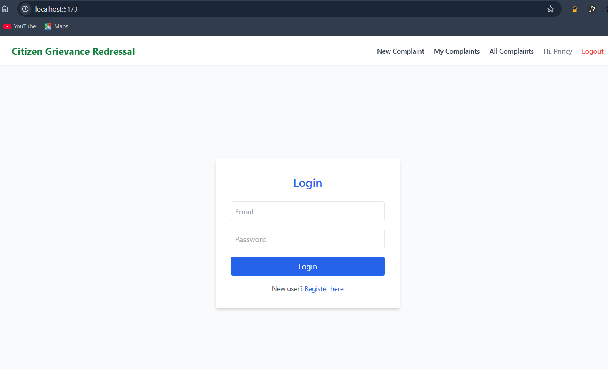
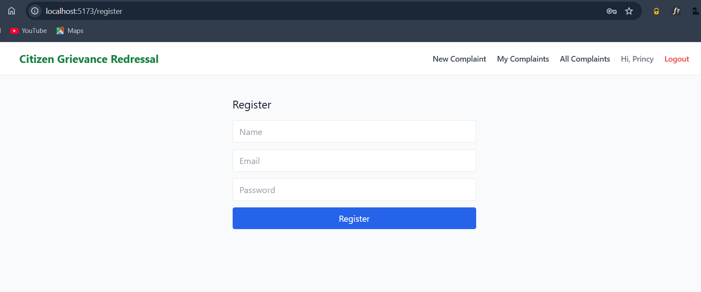
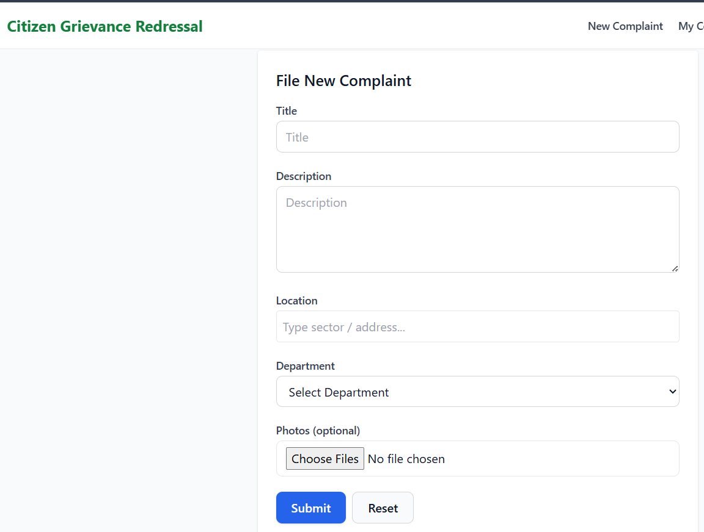
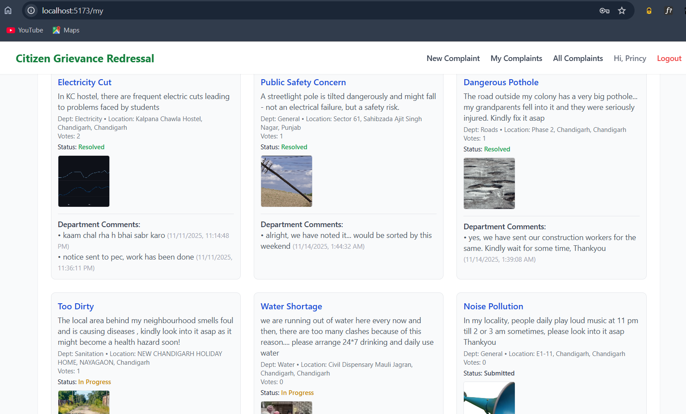
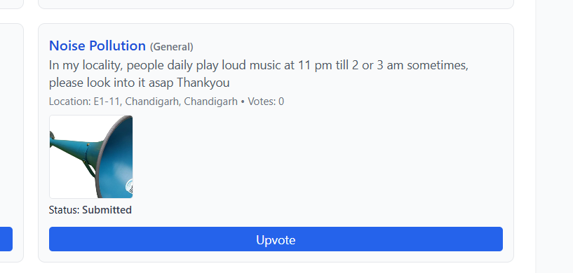
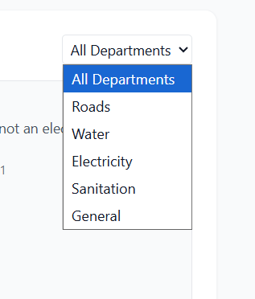
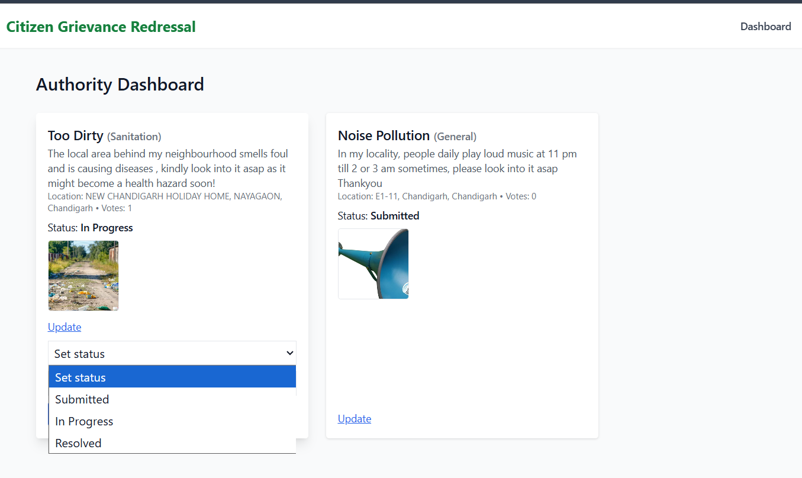
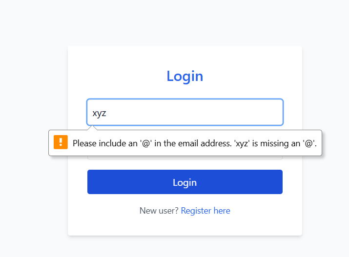
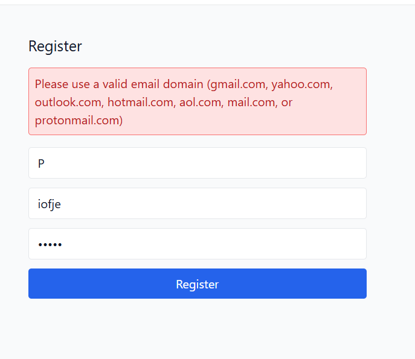
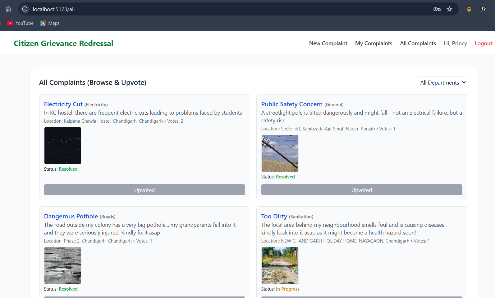

# 🏙️ Citizen Grievance Redressal System (CGRS)

A full-stack web application that enables citizens to seamlessly report civic issues and government authorities to efficiently manage, prioritize and resolve them.
Built with React + Tailwind, Node.js + Express and MongoDB, the system streamlines complaint submission, tracking, and department-wise resolution.

---

## 📌 Table of Contents

- [About the Project](#-about-the-project)
- [Features](#-features)
- [Tech Stack](#-tech-stack)
- [System Architecture](#-system-architecture)
- [Folder Structure](#-folder-structure)
- [Screenshots](#-screenshots)
- [Installation & Setup](#-installation--setup)
- [Environment Variables](#-environment-variables)
- [API Endpoints](#-api-endpoints)
- [Deployment](#-deployment)
- [Future Enhancements](#-future-enhancements)
- [Contributors](#-contributors)
---

## 📖 About the Project

The **City Grievance Redressal System (CGRS)** is a centralized digital platform where citizens can:

✔ Report civic issues (roads, sanitation, electricity, water, etc.)  
✔ Upload photos and location  
✔ Track the status of complaints  
✔ Upvote existing complaints  

Government authorities can:

✔ View department-wise complaints  
✔ Prioritize based on upvotes  
✔ Update status (Submitted → In Progress → Resolved)  
✔ Manage and close complaints  

This system creates a transparent and efficient communication loop between citizens and municipalities.

---

## 🚀 Features

### 👤 Citizen Module

- User registration/login
- Submit complaints with title, description, photo, location & department
- Track status of submitted complaints
- View and upvote other complaints
- Full page view functionality

### 🏛️ Authority Module

- Login with role-based access
- Dashboard showing department-wise complaints
- Sort by priority (upvotes)
- Update complaint status
- Add remarks/comments

### 📊 Admin/Analytics (optional future module)

- View overall system statistics
- See most reported issues
- Track department performance
- Hotspot detection
- Cloud-hosted database (MongoDB Atlas)

### 🔐 Other Features

- Secure authentication (password hashing, JWT)
- Fully mobile-responsive UI

---

## 🛠️ Tech Stack

### Frontend

- React.js
- Tailwind CSS
- Axios
- Vercel (future deployment)

### Backend

- Node.js
- Express.js
- Multer (file uploads)
- JWT authentication
- Render (future deployment)

### Database

- MongoDB Atlas

### Tools

- Git & GitHub

---

## 🏗 System Architecture
```
Frontend (React + Tailwind)
       |
       |  HTTPS (REST API)
       v
Backend (Node.js + Express)
       |
       v
MongoDB Atlas (Cloud Database)
```

---

## 📁 Folder Structure
```
Citizen-Grievance-Redressal-System/
│
├── backend/
│   ├── config/
│   ├── middleware/
│   ├── models/
│   ├── routes/
|   ├── scripts/
│   └── server.js
│
├── frontend/
│   ├── src/
│   │   ├── components/
│   │   ├── pages/
│   │   ├── utils/
│   │   ├── App.jsx
|   |   └── main.jsx
│   └── public/
│
├── README.md
│
├── Data Flow Diagram/
|
└── Unified Modeling Language Diagrams/
```

---

## 📷 Screenshots

<div align="center">
       
       
       
       
       
       
       
       
       
       
</div>

## 🧩 Installation & Setup

### 1️⃣ Clone the Repository
```bash
git clone https://github.com/Varyam20/Citizen-Grievance-Redressal-System.git
cd Citizen-Grievance-Redressal-System
```

### 2️⃣ Setup Backend
```bash
cd backend
npm i
```

Run server:
```bash
npm start
npm run dev
```

### 3️⃣ Setup Frontend
```bash
cd frontend
npm i
npm start
npm run dev
```

**Frontend default URL:**  
`http://localhost:5173/`

**Backend default URL:**  
`http://localhost:5000/`

---

## 🔐 Environment Variables

### Backend `.env`
```env
PORT=5000
MONGO_URI=your_mongodb_atlas_url
JWT_SECRET=your_secret_key
```

### Frontend `.env`
```env
VITE_API_URL=http://localhost:5173
```

---

## 📡 API Endpoints

### Auth

| Method | Endpoint            | Description                  |
|--------|---------------------|------------------------------|
| POST   | `/api/auth/register`| Register citizen             |
| POST   | `/api/auth/login`   | Login (citizen/authority)    |

### Complaints

| Method | Endpoint                    | Description                     |
|--------|-----------------------------|----------------------------------|
| POST   | `/api/complaints`           | Submit complaint                 |
| GET    | `/api/complaints/my`        | Get logged-in user's complaints  |
| GET    | `/api/complaints`           | Get all complaints               |
| PUT    | `/api/complaints/:id`       | Update complaint status          |
| PUT    | `/api/complaints/upvote/:id`| Upvote complaint                 |

---

## 🚀 Deployment

### Frontend

Deploy on **Vercel**:
```bash
vercel deploy
```

### Backend

Deploy on **Render**:

1. Connect GitHub repo
2. Add environment variables
3. Deploy server

### Database

- **MongoDB Atlas** → Free tier cluster

---

## 🌟 Future Enhancements

- Automatic complaint categorization using ML
- Geolocation-based hotspot heatmaps
- Sentiment-based complaint prioritization
- Admin analytics dashboard
- SMS notifications

---

## 👥 Contributors

- Princy Garg
- Varyam Kaur Rai
- Kiranjot Kaur
- Ishita Garg       

---